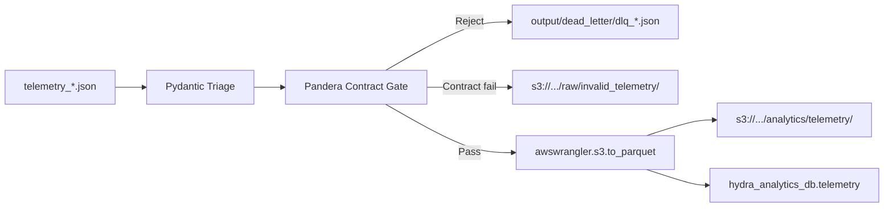

# Phase 6 Completion — AWS Cloud Sink Integration

**Project:** hydra-data-factory  
**Phase:** 6 of 6  
**Status:** Complete  
**Commit:** `b54f21a` — *phase5 & 6*

---

## Overview

Phase 6 connects the local Python ETL pipeline to the live AWS infrastructure provisioned in Phase 5. Validated telemetry is written as Snappy-compressed Parquet to S3 with automatic Glue catalog synchronization. Pandera contract violations are exported to the S3 raw quarantine zone via `boto3`.

When AWS environment variables are absent, the pipeline transparently falls back to local Parquet and DLQ paths from Phase 2.

---

## Objective

1. Route Pandera contract failures to `s3://{bucket}/raw/invalid_telemetry/`
2. Write passing rows to `s3://{bucket}/analytics/telemetry/` via AWS Wrangler
3. Auto-update Glue table `hydra_analytics_db.telemetry` with Hive partitioning on `device_type`
4. Preserve local DLQ audit files for developer inspection

---

## Files Added / Modified (Committed to `origin/main`)

| File | Change |
|------|--------|
| `src/utils/aws_config.py` | **New** — `.env` loading, `AWSDataLakeConfig`, `aws_enabled()` |
| `src/transform/aws_sink.py` | **New** — S3 DLQ upload + `awswrangler.s3.to_parquet()` Glue sync |
| `src/transform/transformer.py` | **Modified** — `device_type` derivation, `get_validated_dataframe()`, `write_analytics_output()` |
| `src/transform/run_etl.py` | **Modified** — `load_dotenv()`, AWS operational summary |
| `src/transform/run_etl_container.py` | **Modified** — AWS-aware incremental processing |
| `requirements.txt` | **Modified** — Added `awswrangler>=3.9.0` |
| `docker-compose.yml` | **Modified** — Optional `env_file: .env` on ETL service |

---

## Environment Configuration

Copy and configure:

```bash
cp .env.example .env
```

Required variables:

```
DATA_LAKE_BUCKET=hydra-data-lakehouse-prod-594397057785
GLUE_DATABASE=hydra_analytics_db
AWS_DEFAULT_REGION=us-east-1
```

Credentials resolve via the standard boto3 chain (`aws configure`, env vars, IAM role).

---

## Data Flow



### Success Path — AWS Wrangler

```python
wr.s3.to_parquet(
    df=frame,
    path="s3://hydra-data-lakehouse-prod-594397057785/analytics/telemetry/",
    dataset=True,
    database="hydra_analytics_db",
    table="telemetry",
    partition_cols=["device_type"],
    mode="append",
    compression="snappy",
)
```

### Failure Path — Contract Violations

Each Pandera contract failure is uploaded as a standalone JSON object:

```
s3://hydra-data-lakehouse-prod-594397057785/raw/invalid_telemetry/invalid_{timestamp}_{id}.json
```

Payload structure: `source_file`, `rejection_reason`, `corruption_type`, `record`.

### Triage Rejections

Pre-contract triage failures (missing `vehicle_id`, `NOT_A_NUMBER` speed, malformed GPS, truncated JSON) route to the **local DLQ** at `output/dead_letter/dlq_*.json` — the pipeline never crashes on bad data.

---

## Production Run — Verified Metrics

| Metric | Value |
|--------|-------|
| JSON batch files scanned | **8,673** |
| Total records ingested | **42,972** |
| Records passed (analytics) | **39,450** |
| Records rejected (triage) | **3,522** |
| Overall acceptance rate | **~91.80%** |
| Post-gate contract rejections | **0%** |
| Glue rows synced | **39,450** |
| S3 target | `s3://hydra-data-lakehouse-prod-594397057785/analytics/telemetry/` |
| Glue target | `hydra_analytics_db.telemetry` |

### Common Triage Rejection Causes

| Corruption Type | Example |
|-----------------|---------|
| `invalid_speed` | `speed_mph: "NOT_A_NUMBER"` |
| `drop_vehicle_id` | Missing or empty `vehicle_id` |
| `truncate_json` | Missing `hardware_version` or `system_logs` |
| `malformed_gps` | `gps_coordinates` without `latitude`/`longitude` |

---

## Run Command

```bash
python -m src.transform.run_etl \
  --input-dir output/telemetry \
  --output-dir output/parquet \
  --dead-letter-dir output/dead_letter
```

Verify in AWS:

```bash
aws s3 ls s3://hydra-data-lakehouse-prod-594397057785/analytics/telemetry/ --recursive | head
aws glue get-table --database-name hydra_analytics_db --name telemetry
```

---

## Design Decisions

| Decision | Rationale |
|----------|-----------|
| Auto-detect AWS via env vars | Single codebase for local dev and cloud production |
| `device_type` Hive partition | Derived from `vehicle_id` prefix (`TORC-AV-001` → `TORC-AV`) |
| Contract failures → S3 immediately | Prevents bad data from reaching analytics prefix |
| Triage failures → local DLQ | Fast developer audit without S3 API calls per row |
| `mode="append"` on Wrangler | Supports incremental ETL container polling |

---

## Deliverables Checklist

- [x] `src/utils/aws_config.py` — Environment-driven lakehouse config
- [x] `src/transform/aws_sink.py` — boto3 DLQ + Wrangler Parquet/Glue sink
- [x] Transformer integration with fallback to local Parquet
- [x] Docker Compose `.env` support
- [x] Production run verified — 39,450 rows synced to S3 + Glue

---

## Next Milestones

| Priority | Milestone |
|----------|-----------|
| 1 | Amazon Athena SQL views over `hydra_analytics_db.telemetry` |
| 2 | dbt staging → mart models with data quality tests |
| 3 | ECS/Fargate deployment using Terraform IAM role |
| 4 | S3 event-driven ETL triggers on new `raw/` objects |
| 5 | CloudWatch metrics for acceptance rate and DLQ volume |
