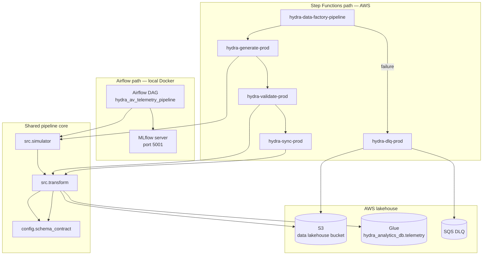

# Hydra Data Factory

Hydra Data Factory is a production-oriented data engineering pipeline for autonomous-vehicle (AV) telemetry. It ingests mock fleet JSON pings, triages corrupted records, enforces a Pandera data contract, and materializes validated rows as Snappy-compressed Parquet in an AWS S3 data lakehouse with Glue catalog metadata. The same core transformation logic in `src/` powers two orchestration modes: a local **Airflow** stack with **MLflow** experiment tracking, and a deployed **Step Functions + Lambda** serverless path on AWS.

The project exists to demonstrate end-to-end lakehouse ETL patterns—schema governance, dead-letter routing, Infrastructure as Code, and dual orchestration—without requiring access to real AV hardware. A kinematic simulator generates temporally coherent TORC-AV fleet telemetry with configurable corruption injection so validation and quarantine paths can be exercised reliably.

## Architecture

Both orchestration paths call into the same Python modules for generation, triage, contract validation, and Glue-backed Parquet writes. They target the same S3 bucket and Glue database when AWS credentials are configured.



**Processing flow (common to both paths):**

1. Generate or read raw JSON telemetry batches
2. Pydantic triage — detect corruption (missing fields, malformed GPS, invalid types)
3. Normalize valid rows to a flat schema with derived `device_type` partition key
4. Pandera contract gate — enforce ranges, regex, and nullability before any Parquet write
5. Write passing rows via AWS Wrangler to `analytics/telemetry/` and sync Glue metadata
6. Route rejected records to dead-letter storage (local JSON, S3 prefixes, or SQS depending on path)

MLflow tracking applies only to the Airflow DAG (`log_run_to_mlflow` task). Lambda handlers log to CloudWatch stdout only.

## Tech stack

### Cloud infrastructure & IaC

- **AWS S3** — data lakehouse bucket (`raw/`, `staging/`, `analytics/telemetry/`, dead-letter prefixes)
- **AWS Glue** (Data Catalog) — `hydra_analytics_db` database and `telemetry` table metadata
- **AWS Lambda** — four container-image functions (generate, validate, sync, DLQ)
- **AWS Step Functions** — `hydra-data-factory-pipeline` state machine
- **AWS ECR** — shared Lambda container image repository
- **AWS SQS** — pipeline failure dead-letter queue
- **AWS CloudWatch Logs** — Lambda and Step Functions execution logging (14-day retention)
- **AWS IAM** — least-scope roles for ETL processor, Lambda, and Step Functions
- **Terraform** — `hashicorp/aws` provider `~> 5.0` (lock file: `5.100.0`)

### Orchestration & MLOps

- **Apache Airflow `2.9.0`** — CeleryExecutor (Postgres metadata DB, Redis broker); DAG `hydra_av_telemetry_pipeline`
- **MLflow `2.14.1`** — experiment tracking server on the Airflow path (`mlflow>=2.14.0` in Airflow worker deps)

### Data processing

- **Python `3.11`** — ETL core, Lambda handlers, Airflow tasks, MLflow server image
- **Pydantic** `>=2.0.0,<3.0.0` — record-level triage and schema validation
- **Pandera** `>=0.20.0,<0.23.0` — DataFrame contract gate
- **pandas** `>=2.0.0,<3.0.0` — columnar transforms
- **PyArrow** `>=14.0.0,<20.0.0` — Parquet read/write
- **awswrangler** `>=3.9.0,<4.0.0` — S3 Parquet I/O and Glue catalog sync
- **boto3** `>=1.34.0,<2.0.0` — S3, SQS, and Glue API calls
- **python-dotenv** `>=1.0.0,<2.0.0` — environment-driven AWS configuration

### Containerization & testing

- **Docker** — multi-stage ETL image (`python:3.11-slim`), Lambda image (`public.ecr.aws/lambda/python:3.11`), MLflow image
- **Docker Compose** — local ETL stack (`docker-compose.yml`) and Airflow + MLflow stack (`docker-compose.airflow.yml`)
- **pytest** `>=8.0.0,<9.0.0` — schema contract and Lambda handler tests
- **moto** `[s3,glue,sqs]>=5.0.0,<6.0.0` — mocked AWS services in unit tests

## Getting started

### Prerequisites

- Python 3.11+ (3.11 recommended; some dependencies lack wheels for 3.14)
- Docker and Docker Compose
- AWS CLI and Terraform (for cloud deployment)

### Local ETL (no Airflow)

```bash
python3 -m venv .venv && source .venv/bin/activate
pip install -r requirements.txt

python -m src.simulator.generator \
  --output-dir output/telemetry --duration 60 --rate 10 --failure-rate 0.08

python -m src.transform.run_etl \
  --input-dir output/telemetry \
  --output-dir output/parquet \
  --dead-letter-dir output/dead_letter
```

Copy `.env.example` to `.env` and set `DATA_LAKE_BUCKET` and `GLUE_DATABASE` to enable the AWS cloud sink during ETL.

### Airflow + MLflow (local)

```bash
mkdir -p output/telemetry output/parquet output/dead_letter logs/airflow
docker compose -f docker-compose.airflow.yml up airflow-init
docker compose -f docker-compose.airflow.yml up
```

- Airflow UI: [http://localhost:8080](http://localhost:8080) (default `airflow` / `airflow`)
- MLflow UI: [http://localhost:5001](http://localhost:5001)
- DAG: `hydra_av_telemetry_pipeline` — generate → ETL → validate → S3/Glue sync → MLflow log

### AWS infrastructure (Terraform)

```bash
cd terraform
terraform init
terraform apply
```

Terraform creates the data lakehouse bucket (name derived from account ID, e.g. `hydra-data-lakehouse-prod-903367786893`), Glue database `hydra_analytics_db`, and the ETL processor IAM role. Applying the Lambda/Step Functions resources additionally creates ECR, four Lambda functions, a Step Functions state machine, and an SQS DLQ.

### Step Functions + Lambda (AWS)

Build and push the shared Lambda image from the **repository root**:

```bash
docker build --platform linux/amd64 --provenance=false --sbom=false \
  -f lambda/Dockerfile -t hydra-lambda .

# After terraform apply provides the ECR URL:
docker tag hydra-lambda:latest <lambda_ecr_repo_url>:latest
docker push <lambda_ecr_repo_url>:latest
```

Trigger a manual execution:

```bash
aws stepfunctions start-execution \
  --state-machine-arn <step_function_arn> \
  --input '{}'
```

See [docs/development-notes/phase-09-step-functions-lambda.md](docs/development-notes/phase-09-step-functions-lambda.md) for deployment debugging notes from the live AWS rollout.

## Project structure

```
hydra-data-factory/
├── config/schema_contract.py      # Pandera DataFrameSchema
├── src/
│   ├── simulator/                   # Mock AV telemetry generator
│   ├── transform/                   # ETL, aws_sink, CLI entrypoints
│   └── utils/                       # logging, AWS config
├── lambda/                          # Step Functions handler entrypoints + Dockerfile
├── dags/hydra_pipeline_dag.py       # Airflow DAG
├── mlflow/                          # MLflow server image (Airflow stack)
├── terraform/                       # S3, Glue, IAM, Lambda, Step Functions
├── tests/                           # pytest (schema contracts + Lambda handlers)
├── docs/development-notes/          # Detailed build history
├── docker-compose.yml               # Simulator + ETL processor
└── docker-compose.airflow.yml       # Airflow + MLflow stack
```

## Tests

```bash
# Schema contract tests
PYTHONPATH=. pytest tests/test_schema_contracts.py -v

# Lambda handler tests (moto; or run inside the Lambda Docker image on Python 3.14 hosts)
pip install -r requirements-test.txt
pytest tests/test_lambda_handlers.py -v
```

## Development notes

Detailed build history, debugging postmortems, and phase-by-phase engineering logs live in [docs/development-notes/](docs/development-notes/). Start with [consolidated-engineering-log.md](docs/development-notes/consolidated-engineering-log.md) for a cross-phase summary, or read individual notes such as [phase-09-step-functions-lambda.md](docs/development-notes/phase-09-step-functions-lambda.md) for the live AWS Step Functions rollout.

## Data contract

Pandera enforces these fields before analytics writes (`config/schema_contract.py`):

| Field | Validation |
|-------|------------|
| `timestamp` | UTC, non-null |
| `vehicle_id` | Regex `^TORC-AV-\d{3}$` |
| `trip_id` | UUID string |
| `speed_mph` | 0.0 – 120.0 |
| `latitude` / `longitude` | WGS-84 bounds |

Additional columns written to analytics Parquet include `device_type`, sensor telemetry fields, and `hardware_version`.

## License

This project is licensed under the MIT License — see [LICENSE](LICENSE) for details.
