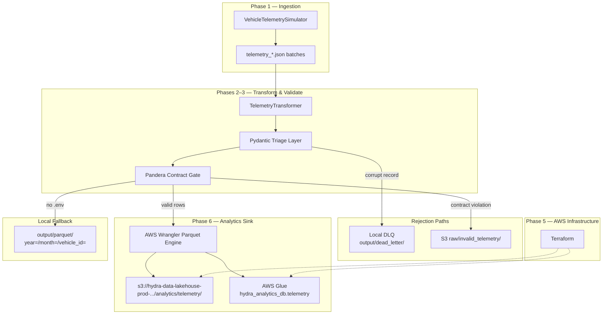

# Hydra Data Factory — Autonomous Vehicle Telemetry Lakehouse

End-to-end data engineering platform for autonomous-vehicle (AV) telemetry: mock fleet ingestion, fault-tolerant ETL, Pandera data contract validation, containerized orchestration, Terraform-managed AWS infrastructure, and Glue-synced Parquet lakehouse storage.

## Phases

| Phase | Status | Description | Documentation |
|-------|--------|-------------|---------------|
| 1 | Complete | Mock telemetry simulator, Pydantic schemas, centralized logging | [PHASE_1_COMPLETION.md](PHASE_1_COMPLETION.md) |
| 2 | Complete | PyArrow ETL, triage layer, Hive-partitioned local Parquet | [PHASE_2_COMPLETION.md](PHASE_2_COMPLETION.md) |
| 3 | Complete | Pandera data contracts, Dockerfile, Docker Compose emulation | [PHASE_3_COMPLETION.md](PHASE_3_COMPLETION.md) |
| 4 | Complete | Pytest validation suite for contract and triage logic | [PHASE_4_COMPLETION.md](PHASE_4_COMPLETION.md) |
| 5 | Complete | Terraform — S3 data lake, Glue catalog, IAM execution role | [PHASE_5_COMPLETION.md](PHASE_5_COMPLETION.md) |
| 6 | Complete | AWS cloud sink — boto3 DLQ routing, Wrangler Parquet + Glue sync | [PHASE_6_COMPLETION.md](PHASE_6_COMPLETION.md) |

See also [phase_completion.md](phase_completion.md) for the consolidated engineering log and production run metrics.

## What This Repository Solves

| Problem | Hydra Solution |
|---------|----------------|
| No realistic AV telemetry for pipeline development | Kinematic mock simulator with configurable corruption injection |
| Bad data crashing ETL jobs | Two-layer triage (Pydantic + Pandera) with Dead-Letter Queue isolation |
| Schema drift into the lakehouse | Pandera `DataFrameSchema` contract gate before any Parquet write |
| No production cloud footprint | Terraform-provisioned S3 + Glue + least-privilege IAM |
| Manual catalog maintenance | AWS Wrangler auto-syncs Glue table on every analytics write |
| Untested validation logic | Pytest suite covering happy path, range violations, and malformed types |

## What the Pipeline Does

1. Generates or ingests raw JSON telemetry batches from TORC-AV fleet devices
2. Triage-inspects each record for corruption modes (missing fields, malformed GPS, invalid types)
3. Normalizes valid rows into a flat columnar schema with derived `device_type` partition keys
4. Enforces a strict Pandera data contract gate before analytics materialization
5. Isolates rejected records to a local JSON Dead-Letter Queue (`output/dead_letter/dlq_*.json`)
6. Writes passing rows as Snappy Parquet to S3 via AWS Wrangler (when `.env` configured)
7. Auto-registers and updates the AWS Glue Data Catalog table `hydra_analytics_db.telemetry`

## Technology Stack

| Layer | Technologies |
|-------|-------------|
| Language | Python 3.11+ |
| Schema validation | Pydantic v2, Pandera |
| Data processing | Pandas, PyArrow, Apache Parquet |
| AWS integration | boto3, AWS Data Wrangler (`awswrangler`) |
| Infrastructure | Terraform (AWS provider ~> 5.0), Amazon S3, AWS Glue, IAM |
| Containerization | Docker (multi-stage), Docker Compose |
| Testing | pytest |
| Configuration | python-dotenv (`.env`) |
| Logging | Python `logging` — stdout + `logs/pipeline.log` |

## Application Architecture

End-to-end data flow from simulated fleet devices to queryable cloud lakehouse:



Processing sequence:

```
telemetry_*.json
  → Pydantic triage (corruption detection)
  → normalize / flatten GPS + system_logs
  → Pandera contract gate (range, regex, nullability)
  → [AWS enabled] awswrangler.s3.to_parquet + Glue sync
  → [local mode]  PyArrow Hive Parquet write
```

## Project Layout

```
hydra-data-factory/
├── config/
│   └── schema_contract.py         # Pandera DataFrameSchema contract
├── src/
│   ├── simulator/
│   │   ├── generator.py           # Mock AV telemetry stream (Phase 1)
│   │   └── schemas.py             # Pydantic ping schema
│   ├── transform/
│   │   ├── transformer.py         # Core ETL engine
│   │   ├── aws_sink.py            # S3 DLQ + Glue Parquet sink (Phase 6)
│   │   ├── run_etl.py             # Local CLI orchestrator
│   │   └── run_etl_container.py   # Docker polling orchestrator
│   └── utils/
│       ├── logger.py              # Unified logging
│       └── aws_config.py          # .env-driven AWS config (Phase 6)
├── terraform/                     # S3, Glue, IAM (Phase 5)
│   ├── main.tf
│   ├── variables.tf
│   └── outputs.tf
├── tests/                         # Pytest suite (Phase 4)
│   ├── conftest.py
│   └── test_schema_contracts.py
├── Dockerfile                     # Multi-stage, non-root appuser
├── docker-compose.yml             # simulator + hydra-etl-processor
├── requirements.txt
├── PHASE_1_COMPLETION.md … PHASE_6_COMPLETION.md
├── phase_completion.md            # Consolidated engineering log
└── README.md
```

## Local Setup (without Docker)

```bash
cd hydra-data-factory
python3 -m venv .venv
source .venv/bin/activate
pip install -r requirements.txt

# Step 1 — Generate mock telemetry
python -m src.simulator.generator \
  --output-dir output/telemetry \
  --duration 60 \
  --rate 10 \
  --failure-rate 0.08

# Step 2 — Run ETL (local Parquet when .env absent)
python -m src.transform.run_etl \
  --input-dir output/telemetry \
  --output-dir output/parquet \
  --dead-letter-dir output/dead_letter

# Step 3 — Run tests
PYTHONPATH=. pytest tests/test_schema_contracts.py -v
```

## AWS Cloud Sink Setup

Create a `.env` file in the project root:

```
DATA_LAKE_BUCKET=hydra-data-lakehouse-prod-594397057785
GLUE_DATABASE=hydra_analytics_db
AWS_DEFAULT_REGION=us-east-1
```

When both `DATA_LAKE_BUCKET` and `GLUE_DATABASE` are set, `run_etl.py` automatically:

- Uploads Pandera contract violations to `s3://{bucket}/raw/invalid_telemetry/`
- Writes validated Parquet to `s3://{bucket}/analytics/telemetry/` (partitioned by `device_type`)
- Syncs schema metadata to Glue table `telemetry`

```bash
python -m src.transform.run_etl \
  --input-dir output/telemetry \
  --output-dir output/parquet \
  --dead-letter-dir output/dead_letter
```

## Terraform Deployment (Phase 5)

```bash
cd terraform
terraform init
terraform apply
```

Live infrastructure:

| Resource | Value |
|----------|-------|
| S3 bucket | `hydra-data-lakehouse-prod-594397057785` |
| Glue database | `hydra_analytics_db` |
| Raw prefix | `raw/` |
| Analytics prefix | `analytics/telemetry/` |
| Hive partition | `device_type` (e.g., `TORC-AV`) |

Verify:

```bash
aws s3 ls s3://hydra-data-lakehouse-prod-594397057785/analytics/telemetry/ --recursive | head
aws glue get-table --database-name hydra_analytics_db --name telemetry
```

## Docker Deployment

```bash
mkdir -p output/telemetry output/parquet output/dead_letter logs
docker compose up --build
```

| Service | Role |
|---------|------|
| `simulator` | Continuous JSON telemetry generation into `/data/telemetry` |
| `hydra-etl-processor` | Polling ETL with Pandera gate and optional AWS sink |

Host-mounted outputs:

```
output/telemetry/     # Raw JSON batches
output/parquet/       # Local Parquet fallback
output/dead_letter/   # DLQ audit JSON (dlq_*.json)
logs/                 # pipeline.log
```

Stop: `docker compose down`

## Run Tests Inside the Container

```bash
docker compose build
docker compose run --rm hydra-etl-processor pytest tests/test_schema_contracts.py -v
```

## Data Contract Schema

Fields enforced by Pandera (`config/schema_contract.py`) and registered in AWS Glue:

| Field | Type | Validation |
|-------|------|------------|
| `timestamp` | UTC timestamp | Required, non-null |
| `vehicle_id` | string | Regex `^TORC-AV-\d{3}$` |
| `trip_id` | string | UUID string |
| `speed_mph` | double | Range `0.0`–`120.0` |
| `latitude` | double | WGS-84: `-90.0`–`90.0` |
| `longitude` | double | WGS-84: `-180.0`–`180.0` |

Additional analytics columns: `sensor_status`, `brake_pressure`, `lidar_temp_c`, `compute_load_pct`, `hardware_version`, `device_type`.

## Operational Metrics & Performance

Latest verified production run:

| Metric | Value |
|--------|-------|
| JSON batch files scanned | 8,673 |
| Total records ingested | 42,972 |
| Records passed (analytics) | 39,450 |
| Records rejected (triage) | 3,522 |
| Overall acceptance rate | ~91.80% |
| Post-gate contract rejections | 0% |
| Glue rows synced | 39,450 |
| S3 target | `s3://hydra-data-lakehouse-prod-594397057785/analytics/telemetry/` |
| Glue catalog | `hydra_analytics_db.telemetry` |

## License

Portfolio / educational project.
