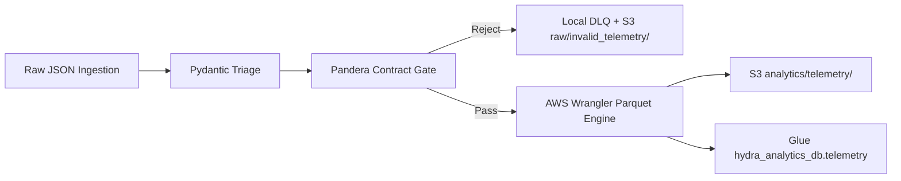

# Hydra Data Factory — Engineering Phase Report

This document records the design, implementation, and verification history of the **Autonomous Vehicle Telemetry Lakehouse** pipeline. Each phase builds on the previous one to form a production-oriented data engineering platform spanning local ingestion, schema governance, containerized orchestration, automated testing, Infrastructure as Code, and AWS cloud sink integration.

---

## Phase Summary

See individual development notes for detailed engineering logs:

| Phase | Document |
|-------|----------|
| 1 | [phase-01-telemetry-simulator-and-schemas.md](phase-01-telemetry-simulator-and-schemas.md) |
| 2 | [phase-02-etl-partitioned-parquet.md](phase-02-etl-partitioned-parquet.md) |
| 3 | [phase-03-pandera-docker-compose.md](phase-03-pandera-docker-compose.md) |
| 4 | [phase-04-pytest-schema-contracts.md](phase-04-pytest-schema-contracts.md) |
| 5 | [phase-05-terraform-data-lakehouse.md](phase-05-terraform-data-lakehouse.md) |
| 6 | [phase-06-aws-s3-glue-sink.md](phase-06-aws-s3-glue-sink.md) |
| 7 | [phase-07-airflow-orchestration.md](phase-07-airflow-orchestration.md) |
| 8 | [phase-08-mlflow-experiment-tracking.md](phase-08-mlflow-experiment-tracking.md) |
| 9 | [phase-09-step-functions-lambda.md](phase-09-step-functions-lambda.md) |

---

## Production Run — Verified Metrics

Results from the latest successful end-to-end run (local JSON ingestion → Pandera gate → S3 Parquet → Glue catalog sync):

| Metric | Value | Notes |
|--------|-------|-------|
| JSON batch files scanned | **8,673** | `telemetry_*.json` under `output/telemetry/` |
| Total records ingested | **42,972** | All TORC-AV fleet device types |
| Records passed (analytics) | **39,450** | Cleared triage + Pandera contract gate |
| Records rejected (triage) | **3,522** | Isolated to local DLQ audit files |
| Overall acceptance rate | **~91.80%** | 39,450 / 42,972 |
| Post-gate contract rejections | **0%** | All rejections caught at pre-Parquet triage |
| Glue rows synced | **39,450** | Via `awswrangler.s3.to_parquet(dataset=True)` |
| DLQ output | `output/dead_letter/dlq_*.json` | Structured audit with rejection reasons |

### Triage Rejection Breakdown

| Corruption Type | Example |
|-----------------|---------|
| `invalid_speed` | `speed_mph: "NOT_A_NUMBER"` |
| `drop_vehicle_id` | Missing or empty `vehicle_id` |
| `truncate_json` | Missing `hardware_version` or `system_logs` |
| `malformed_gps` | `gps_coordinates` without `latitude`/`longitude` keys |

---

## Infrastructure Targets — AWS CLI Verified

| Resource | Target | Verification Command |
|----------|--------|----------------------|
| S3 data lake bucket | `hydra-data-lakehouse-prod-594397057785` | `aws s3 ls s3://hydra-data-lakehouse-prod-594397057785/` |
| Analytics Parquet prefix | `analytics/telemetry/` | `aws s3 ls s3://hydra-data-lakehouse-prod-594397057785/analytics/telemetry/ --recursive \| head` |
| Raw invalid telemetry | `raw/invalid_telemetry/` | `aws s3 ls s3://hydra-data-lakehouse-prod-594397057785/raw/invalid_telemetry/` |
| Glue database | `hydra_analytics_db` | `aws glue get-database --name hydra_analytics_db` |
| Glue table | `telemetry` | `aws glue get-table --database-name hydra_analytics_db --name telemetry` |
| Hive partition column | `device_type=TORC-AV` | Visible in S3 path layout and Glue table parameters |

---

## Phase 1 — Core Ingestion & Mock Telemetry Simulator

**Status:** 100% Complete  
**Primary modules:** `src/simulator/generator.py`, `src/simulator/schemas.py`

### Objective

Establish the project skeleton, Pydantic telemetry schema, kinematic mock data simulator, and centralized logging utility.

### Results

- Stateful per-vehicle GPS/speed evolution producing temporally coherent trajectories
- Configurable `failure_rate` injecting corruption modes for downstream triage testing
- Batch JSON output convention: `telemetry_{vehicle_id}_{timestamp}.json`

---

## Phase 2 — PyArrow ETL & Hive-Partitioned Parquet

**Status:** 100% Complete  
**Primary module:** `src/transform/transformer.py`

### Objective

Build a fault-tolerant ETL engine that triages corrupted JSON, flattens nested GPS coordinates, and writes Hive-partitioned Parquet locally.

### Architecture

```
telemetry_*.json → triage → normalize → PyArrow cast → year=/month=/vehicle_id= Parquet
                              ↓ failures
                     output/dead_letter/
```

### Results

- DLQ routing without pipeline crash on bad records
- Local layout: `output/parquet/year=YYYY/month=MM/vehicle_id=VAL/*.parquet`

---

## Phase 3 — Pandera Data Contract Validation & Containerization

**Status:** 100% Complete  
**Primary modules:** `config/schema_contract.py`, `Dockerfile`, `docker-compose.yml`

### Objective

Enforce **Data Quality Gates** via Pandera before Parquet writes and package the pipeline for **Containerized ETL Orchestration**.

### Contract Rules

| Column | Validation |
|--------|------------|
| `vehicle_id` | Regex `^TORC-AV-\d{3}$`, non-null |
| `timestamp` | UTC datetime, non-null |
| `speed_mph` | Range `0.0`–`120.0` |
| `latitude` / `longitude` | WGS-84 coordinate bounds |

### Results

- Multi-stage Dockerfile with non-root `appuser`
- Docker Compose `simulator` + `hydra-etl-processor` services with host volume sync

---

## Phase 4 — Automated Testing Framework

**Status:** 100% Complete  
**Primary module:** `tests/test_schema_contracts.py`

### Objective

Validate Pandera contract logic, triage handling, and schema enforcement with pytest.

### Results

| Test | Coverage |
|------|----------|
| `test_contract_passes_valid_data` | Happy-path contract validation |
| `test_contract_rejects_negative_speed` | Logical range violation → `SchemaErrors` |
| `test_triage_handles_malformed_types` | `NOT_A_NUMBER` speed rejected at triage |

Run inside Docker:

```bash
docker compose run --rm hydra-etl-processor pytest tests/test_schema_contracts.py -v
```

---

## Phase 5 — Infrastructure as Code (Terraform)

**Status:** 100% Complete  
**Primary module:** `terraform/main.tf`

### Objective

Provision AWS resources for the lakehouse architecture: S3 data lake, Glue catalog database, and fine-grained IAM execution role.

### Resources Provisioned

| Resource | Name / Pattern |
|----------|----------------|
| S3 bucket | `hydra-data-lakehouse-prod-594397057785` |
| Bucket versioning | Enabled |
| Bucket encryption | AES256 |
| Glue database | `hydra_analytics_db` |
| IAM role | `{project}-etl-processor-{env}` |
| IAM policy | `GetObject`/`ListBucket` on `raw/*`; `PutObject` on `analytics/*` |

Deploy:

```bash
cd terraform
terraform init
terraform apply
```

---

## Phase 6 — AWS Cloud Sink Integration

**Status:** 100% Complete  
**Primary modules:** `src/transform/aws_sink.py`, `src/utils/aws_config.py`

### Objective

Connect the local Python pipeline to live AWS resources: stream contract failures to S3 raw zone and sync validated Parquet to the Glue catalog.

### Architecture



### Environment Configuration

```bash
cp .env.example .env
```

```
DATA_LAKE_BUCKET=hydra-data-lakehouse-prod-594397057785
GLUE_DATABASE=hydra_analytics_db
AWS_DEFAULT_REGION=us-east-1
```

### Run Command

```bash
python -m src.transform.run_etl \
  --input-dir output/telemetry \
  --output-dir output/parquet \
  --dead-letter-dir output/dead_letter
```

When `.env` is configured, valid rows are written via:

```python
awswrangler.s3.to_parquet(
    path="s3://{bucket}/analytics/telemetry/",
    dataset=True,
    database="hydra_analytics_db",
    table="telemetry",
    partition_cols=["device_type"],
)
```

### Results

- 39,450 rows synced to S3 Parquet under `analytics/telemetry/device_type=TORC-AV/`
- Glue table `hydra_analytics_db.telemetry` auto-updated with schema metadata
- 3,522 triage rejections isolated to `output/dead_letter/dlq_*.json`
- 0 post-gate Pandera contract rejections on the production run

---

## Test Summary

| Phase | Test module | Cases | Status |
|-------|-------------|-------|--------|
| 4 | `tests/test_schema_contracts.py` | 3 | Passing |

Run locally:

```bash
PYTHONPATH=. pytest tests/ -v
```

---

## Next Milestones

| Priority | Milestone | Description |
|----------|-----------|-------------|
| 1 | **Amazon Athena analytical views** | Create external table DDL and curated SQL views over `hydra_analytics_db.telemetry` for ad-hoc fleet analytics |
| 2 | **dbt modeling layer** | Introduce dbt project for staged → intermediate → mart models with data quality tests |
| 3 | **ECS/Fargate deployment** | Run `hydra-etl-processor` container on AWS with Terraform-managed task definitions |
| 4 | **Event-driven ingestion** | S3 event notifications triggering ETL on new `raw/` object landings |
| 5 | **Observability** | CloudWatch metrics for acceptance rate, DLQ volume, and Glue sync latency |

---

## Run the Full Pipeline

Local (with AWS sink):

```bash
cp .env.example .env
python3 -m venv .venv && source .venv/bin/activate
pip install -r requirements.txt

python -m src.simulator.generator --output-dir output/telemetry --duration 60 --rate 10 --failure-rate 0.08
python -m src.transform.run_etl --input-dir output/telemetry --output-dir output/parquet --dead-letter-dir output/dead_letter
```

Docker:

```bash
mkdir -p output/telemetry output/parquet output/dead_letter logs
docker compose up --build
```

Expected flow: JSON ingest → triage → Pandera gate → DLQ isolation → S3 Parquet → Glue catalog sync.
